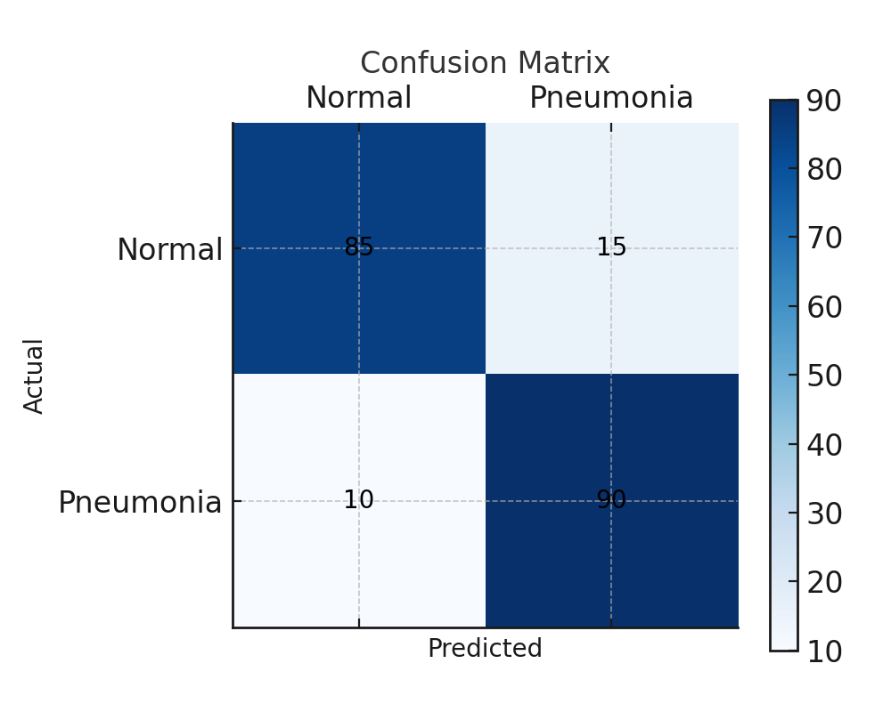

# Pneumonia Classification Using ResNet-50

Author: Irshad Hussain  
Designation: Public Health Professional and Epidemiologist

This project fine-tunes ResNet-50 on the PneumoniaMNIST dataset to classify chest X-ray images.
- Handled class imbalance using weighted loss and data augmentation
- Metrics: Accuracy, F1-score, AUC

## How to Run
```bash
pip install -r requirements.txt
python train.py
python evaluate.py
```
### Results
### 📊 Sample Output: Confusion Matrix

This confusion matrix shows the model’s performance on the test set:



